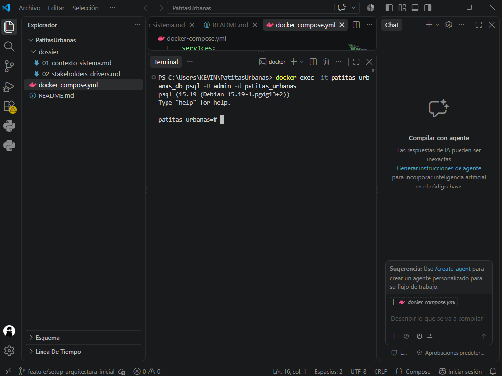
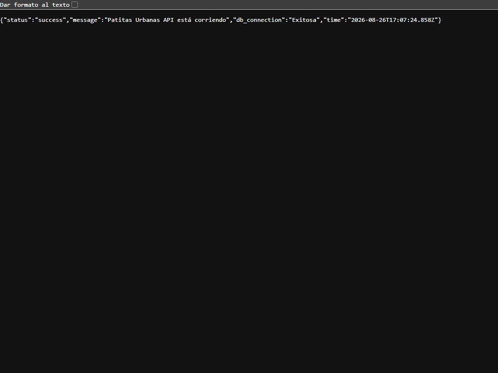
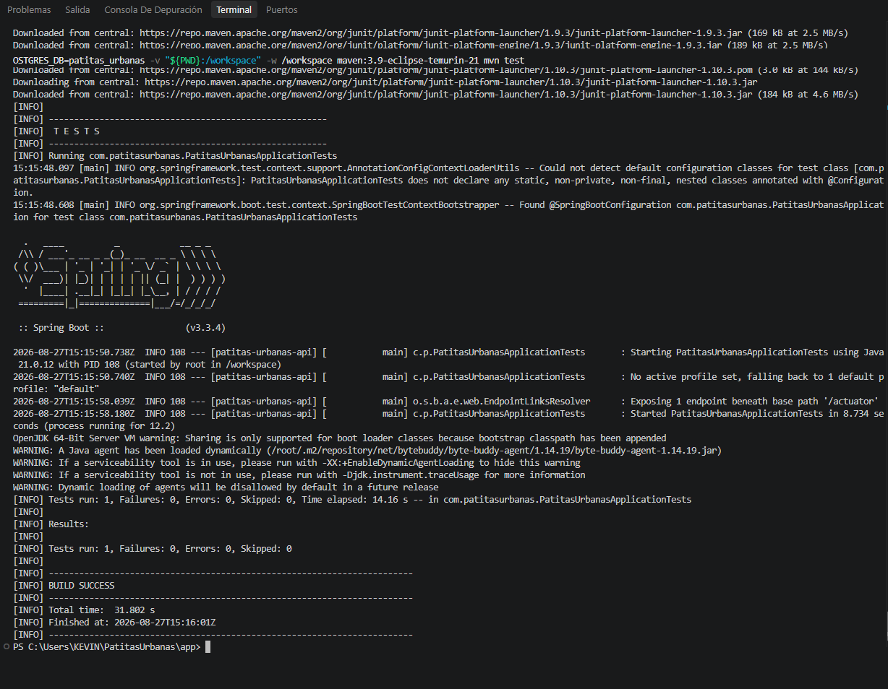

# PatitasUrbanas

## Levantar la base de datos

El proyecto utiliza PostgreSQL mediante Docker Compose. Para levantar la base de datos después de clonar el repositorio:

1. Instala [Docker Desktop](https://www.docker.com/products/docker-desktop/) y asegúrate de que esté iniciado.
2. Abre una terminal en la carpeta raíz del proyecto.
3. Ejecuta:

```powershell
docker compose up -d
```

Este comando crea el contenedor `patitas_urbanas_db`, inicia PostgreSQL 16 y conserva los datos nuevos en el volumen `pgdata_v16`.

Para comprobar el estado del servicio:

```powershell
docker compose ps
```

Para detener el servicio sin eliminar los datos:

```powershell
docker compose down
```

Datos de conexión local:

- Host: `localhost`
- Puerto: `5433`
- Nota: 5433 al conectarte desde tu máquina; 5432 es el puerto interno usado entre contenedores de Docker.
- Base de datos: `patitas_urbanas`
- Usuario: `admin`
- Contraseña: `adminpassword`

## Evidencia de Ejecución Local (Semana 1)
A continuación, se demuestra la correcta inicialización del contenedor y la conexión exitosa al motor de base de datos PostgreSQL en el entorno de desarrollo local.



## Evidencia de Ejecución de la API



## Validación de pruebas

Las pruebas de validación confirman de manera consistente que el *healthcheck* de la base de datos se mantiene en estado `healthy` y que el endpoint de la API responde con el código de estado HTTP `200`.

