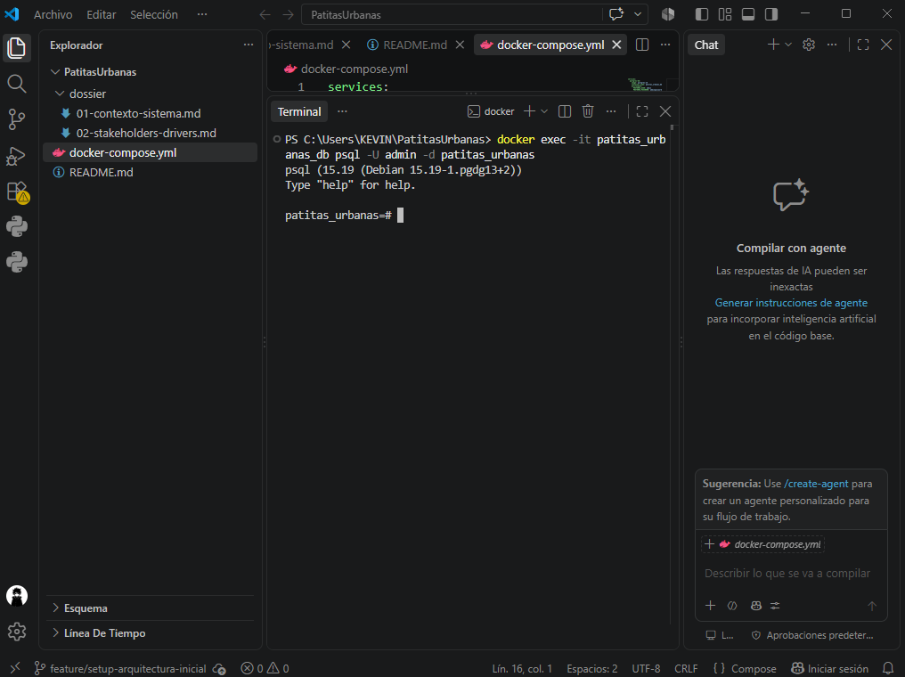
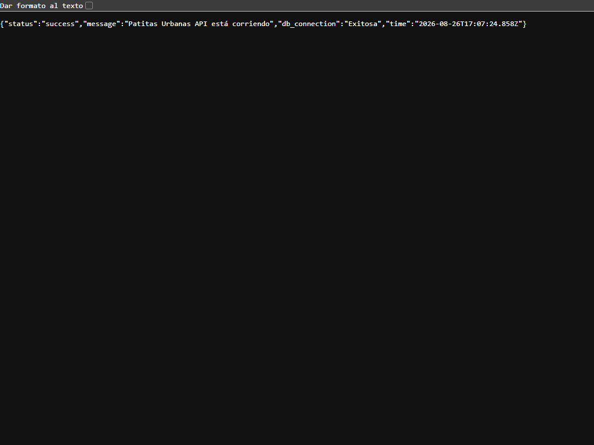
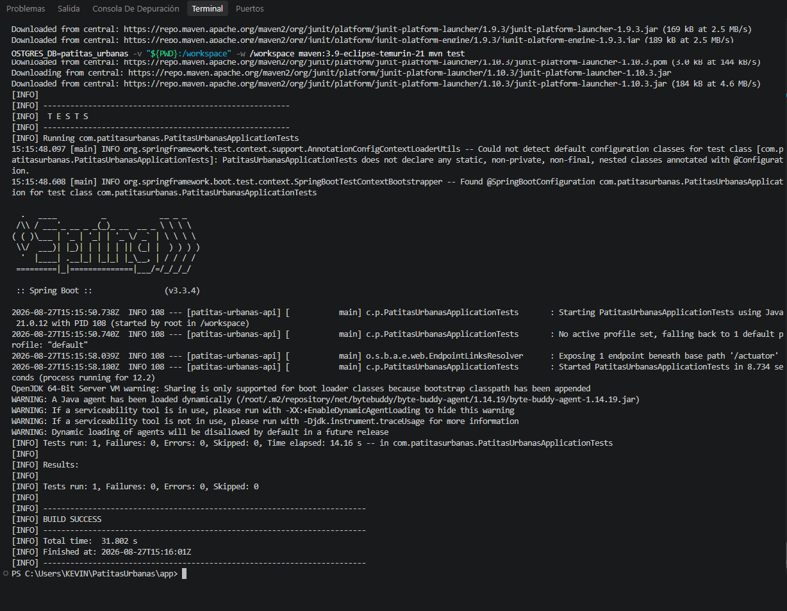

# PatitasUrbanas

## Levantar la base de datos

El proyecto utiliza PostgreSQL mediante Docker Compose. Para levantar la base de datos después de clonar el repositorio:

1. Instala [Docker Desktop](https://www.docker.com/products/docker-desktop/) y asegúrate de que esté iniciado.
2. Abre una terminal en la carpeta raíz del proyecto.
3. Ejecuta:

```powershell
docker compose up -d
```

Este comando crea el contenedor `patitas_urbanas_db`, inicia PostgreSQL 16 y conserva los datos nuevos en el volumen `pgdata_v16`.

Para comprobar el estado del servicio:

```powershell
docker compose ps
```

Para detener el servicio sin eliminar los datos:

```powershell
docker compose down
```

Datos de conexión local:

- Host: `localhost`
- Puerto: `5433`
- Nota: 5433 al conectarte desde tu máquina; 5432 es el puerto interno usado entre contenedores de Docker.
- Base de datos: `patitas_urbanas`
- Usuario: `admin`
- Contraseña: `adminpassword`

## Evidencia de Ejecución Local (Semana 1)
A continuación, se demuestra la correcta inicialización del contenedor y la conexión exitosa al motor de base de datos PostgreSQL en el entorno de desarrollo local.



## Evidencia de Ejecución de la API



## Validación de pruebas

Las pruebas de validación confirman de manera consistente que el *healthcheck* de la base de datos se mantiene en estado `healthy` y que el endpoint de la API responde con el código de estado HTTP `200`.


## Módulo 5 — Dominio, integración y Spike 1 (Semanas 9–10)

| Entregable | Dónde está |
|---|---|
| 1. Modelo del dominio y Context Map | [`docs/dominio/modelo-dominio.md`](docs/dominio/modelo-dominio.md) (evidencia y decisiones), [`docs/dominio/subdominios.md`](docs/dominio/subdominios.md), [`docs/dominio/responsabilidades-contextos.md`](docs/dominio/responsabilidades-contextos.md), [`docs/dominio/context-map.puml`](docs/dominio/context-map.puml) ([PNG](docs/dominio/context-map.png)) |
| 2. Decisión síncrono / asíncrono | [`docs/integracion/sincrono-vs-asincrono.md`](docs/integracion/sincrono-vs-asincrono.md) |
| 3. Contrato API | [`docs/integracion/contrato-api.yaml`](docs/integracion/contrato-api.yaml) (OpenAPI 3.0) |
| 4. Eventos candidatos | [`docs/integracion/eventos-candidatos.md`](docs/integracion/eventos-candidatos.md) |
| 5. CQRS y Event Sourcing | [`docs/integracion/cqrs-event-sourcing.md`](docs/integracion/cqrs-event-sourcing.md), [`dossier/17-cqrs-consistencia-eventual-s10.md`](dossier/17-cqrs-consistencia-eventual-s10.md) |
| 6. Preregistro del Spike 1 | [`experimentos/04-spike-especificacion-s9.md`](experimentos/04-spike-especificacion-s9.md) |
| 7. Rama experimental | `spike/fronteras-modulares-s10` (desde `887ccf1`); control descartable `spike/control-y2-descartable` |
| 8. Ejecución, resultados y veredicto | [`experimentos/06-spike-resultado-s10.md`](experimentos/06-spike-resultado-s10.md), evidencia en [`experimentos/spike-s10/`](experimentos/spike-s10/); orden temporal verificado en [`experimentos/07-trazabilidad-temporal.md`](experimentos/07-trazabilidad-temporal.md) |
| 9. ADR 3 | [`adr/adr-03-limites-y-comunicacion-modulos.md`](adr/adr-03-limites-y-comunicacion-modulos.md) |
| 10. Registro crítico de IA | [`experimentos/05-auditoria-ia-s9.md`](experimentos/05-auditoria-ia-s9.md) (spike), [`docs/integracion/registro-ia-modulo5.md`](docs/integracion/registro-ia-modulo5.md) (dominio e integración) |
