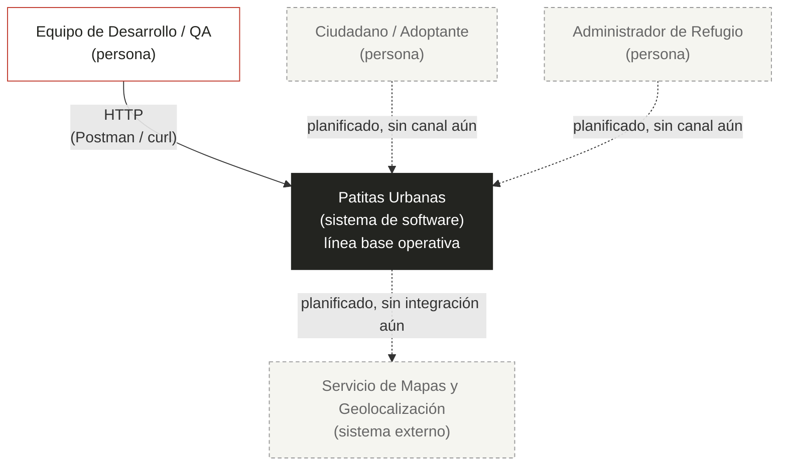

# 05 — C4 Nivel 1: Diagrama de Contexto (Arquitectura Actual)

## Propósito y audiencia de esta vista

Esta vista responde a la pregunta: **¿quién interactúa hoy con Patitas Urbanas, quién está planeado que interactúe, y con qué otros sistemas se comunica realmente el sistema en su estado actual (as-is)?**

Está dirigida a audiencias no técnicas y técnicas por igual: stakeholders del proyecto (equipo docente, fundaciones interesadas) que necesitan entender el alcance real ya construido frente al alcance planeado, y al propio equipo de desarrollo como línea base para futuras iteraciones. La distinción visual entre lo verificado y lo planificado evita presentar el diseño deseado ([`[dossier/01-contexto-sistema.md](../dossier/01-contexto-sistema.md)`](../[dossier/01-contexto-sistema.md](../dossier/01-contexto-sistema.md))) como si ya estuviera implementado.

## Diagrama de contexto (validado contra el código)

**Leyenda:** línea sólida = relación verificada en código · línea punteada = relación planificada, aún no implementada.

## Elementos representados

| Elemento | Tipo | Estado |
|---|---|---|
| Equipo de Desarrollo / QA | Persona | Verificado |
| Patitas Urbanas (API línea base) | Sistema de software | Verificado (alcance parcial) |
| Ciudadano / Adoptante | Persona | Planificado (no implementado) |
| Administrador de Refugio | Persona | Planificado (no implementado) |
| Servicio de Mapas y Geolocalización | Sistema externo | Planificado (no implementado) |

## Elementos planificados, aún no implementados

Los tres elementos marcados como "Planificado" están formalmente declarados en [`[dossier/01-contexto-sistema.md](../dossier/01-contexto-sistema.md)`](../[dossier/01-contexto-sistema.md](../dossier/01-contexto-sistema.md)) como parte de la visión del producto, pero ninguno tiene hoy un canal de interacción real en el repositorio: no existe cliente web, cliente móvil, ni integración con un proveedor de mapas en el código fuente. Se mantienen en el diagrama —con estilo punteado— para no perder de vista el alcance objetivo, pero no se presentan como parte de la arquitectura ya construida.

Esto es distinto al caso del contenedor de caché NoSQL (ver `06-c4-contenedores.md`), que no está "pendiente de construir" sino que fue **descartado activamente** por el equipo tras una decisión de arquitectura documentada.

## Relación verificada

- **Equipo de Desarrollo / QA → Patitas Urbanas**: comprobada mediante las capturas [`evidencia_ejecucion_api.png`](../evidencia_ejecucion_api.png) y [`evidencia_pruebas_java.png`](../evidencia_pruebas_java.png) (README.md), que muestran respuestas HTTP 200 del endpoint de salud y la ejecución exitosa de `PatitasUrbanasApplicationTests.java`.
