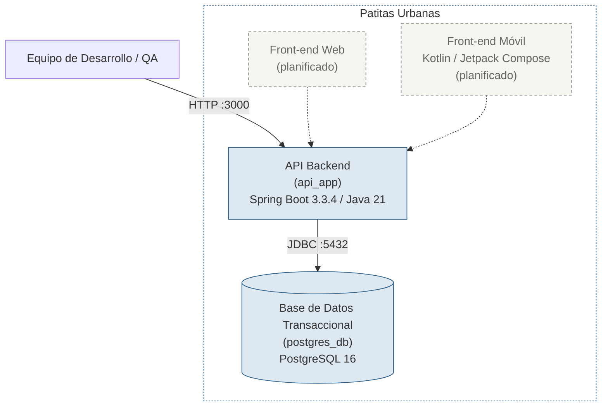

# 06 — C4 Nivel 2: Diagrama de Contenedores (Arquitectura Actual)

## Propósito y audiencia de esta vista

Esta vista responde a la pregunta: **¿qué aplicaciones y almacenes de datos existen realmente hoy en el repositorio, cuáles están planificados, y cómo se comunican entre sí?**

Está dirigida principalmente al equipo de desarrollo y a quien evalúe la trazabilidad del proyecto: define las piezas desplegables reales frente a las planeadas. Toda pieza que no tenga un `Dockerfile`, una definición en [`docker-compose.yml`](../docker-compose.yml) o código fuente correspondiente se marca explícitamente como planificada o descartada, nunca como ya construida.

## Diagrama de contenedores (validado contra el código)

**Leyenda:** relleno azul + línea sólida = contenedor verificado en código · relleno gris + línea punteada = contenedor planificado, aún no implementado.

## Contenedores verificados

### API Backend (`api_app`)
- **Tecnología:** Spring Boot 3.3.4, Java 21, Maven.
- **Responsabilidad actual:** exponer el proceso Java empaquetado como `.jar`, con el endpoint de salud `/actuator/health` habilitado (`spring-boot-starter-actuator`), y conectarse a la base de datos vía JDBC plano (`spring-boot-starter-jdbc` + driver `org.postgresql`).
- **Evidencia:** [`app/pom.xml`](../app/pom.xml), [`app/Dockerfile`](../app/Dockerfile), [`app/src/main/resources/application.properties`](../app/src/main/resources/application.properties), [`docker-compose.yml`](../docker-compose.yml) (servicio `api_app`, puerto `3000:3000`).
- **Nota importante:** no existen aún dependencias de seguridad (`spring-security`), JWT, ni de persistencia por ORM (`spring-data-jpa`). El contenedor no expone todavía ningún endpoint de negocio (adopciones, reportes, foros, autenticación).

### Base de Datos Transaccional (`postgres_db`)
- **Tecnología:** PostgreSQL 16 (imagen oficial `postgres:16`).
- **Responsabilidad actual:** persistencia del motor relacional; actualmente sin esquema de tablas de negocio definido en el repositorio (no se encontraron scripts de migración ni entidades JPA).
- **Evidencia:** [`docker-compose.yml`](../docker-compose.yml) (servicio `postgres_db`, healthcheck con `pg_isready`, volumen `pgdata_v16`), [`README.md`](../README.md) (credenciales y comando `docker compose up -d`).

## Relación verificada

- **API Backend → Base de Datos Transaccional**: conexión JDBC confirmada en [`application.properties`](../app/src/main/resources/application.properties) (`spring.datasource.url=jdbc:postgresql://${DB_HOST:localhost}:5432/...`) y en la dependencia `depends_on: postgres_db (condition: service_healthy)` de [`docker-compose.yml`](../docker-compose.yml).

## Contenedores planificados, aún no implementados

| Contenedor planificado | Estado | Justificación |
|---|---|---|
| Front-end Web | Planificado (no implementado) | No existe carpeta ni proyecto de frontend en el repositorio, pero sí una restricción de despliegue declarada ([`[dossier/01-contexto-sistema.md](../dossier/01-contexto-sistema.md)`](../[dossier/01-contexto-sistema.md](../dossier/01-contexto-sistema.md)): "El cliente web debe ser compatible con la red de distribución de Vercel"). |
| Front-end Móvil (Kotlin / Jetpack Compose) | Planificado (no implementado) | No existe módulo Android en el repositorio, pese a estar declarado como restricción técnica en [`[dossier/01-contexto-sistema.md](../dossier/01-contexto-sistema.md)`](../[dossier/01-contexto-sistema.md](../dossier/01-contexto-sistema.md)). |

## Contenedor descartado (decisión de arquitectura, no falta de tiempo)

| Contenedor propuesto | Estado | Motivo de la eliminación |
|---|---|---|
| Caché / Almacenamiento no estructurado (Firestore / MongoDB) | Eliminado (decisión de arquitectura) | [`[dossier/02-stakeholders-drivers.md](../dossier/02-stakeholders-drivers.md)`](../[dossier/02-stakeholders-drivers.md](../dossier/02-stakeholders-drivers.md)) (riesgo R-03) documenta que el equipo migró deliberadamente de un modelo NoSQL hacia PostgreSQL como única fuente de verdad transaccional. No es trabajo pendiente: es una alternativa ya evaluada y descartada. |

El detalle completo de esta auditoría, con anclas exactas de archivo/clase, está en la tabla de trazado de `07-c4-componentes.md`.
