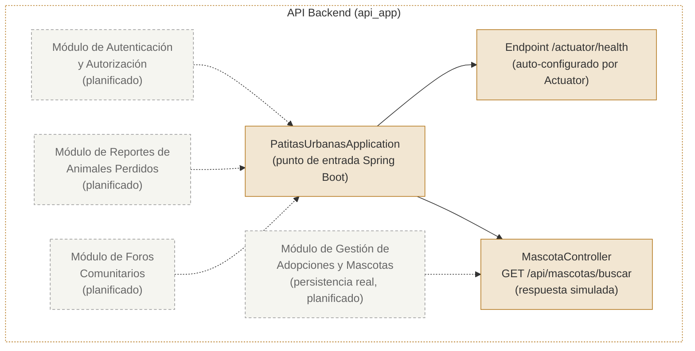

# 07 — C4 Nivel 3: Diagrama de Componentes, Correcciones y Tabla de Trazado

## Propósito y audiencia de esta vista

Esta vista responde a la pregunta: **¿qué piezas internas del contenedor API Backend existen hoy como código verificable, y cuáles siguen siendo diseño planificado?**

Está dirigida al equipo de desarrollo que continuará implementando el sistema: identifica exactamente dónde termina la infraestructura ya construida y dónde empieza el trabajo pendiente. Es, junto con la tabla de trazado, el artefacto de auditoría central del módulo.

## Hallazgo principal de la auditoría

El contenedor **API Backend** (`api_app`) evolucionó de una línea base operativa a un **primer componente de negocio verificado**: existe un paquete `controller/` con una clase, `MascotaController` (`app/src/main/java/com/patitasurbanas/api/controller/MascotaController.java`), que expone un endpoint REST real. **No existen todavía servicios ni repositorios de negocio** (no hay paquetes `service/`, `repository/` ni `model/`, ni dependencia `spring-data-jpa` en `pom.xml`): el controlador no persiste ni consulta datos, solo devuelve una respuesta simulada. Los tres módulos de negocio restantes (Autenticación, Reportes, Foros) siguen siendo **diseño planificado (to-be)**.

**Nota de trazabilidad importante:** el endpoint `GET /api/mascotas/buscar` recibe parámetros geoespaciales (`lat`, `lng`, `radio`) pero **no ejecuta ninguna consulta a PostgreSQL/PostGIS**. El propio código lo declara explícitamente en un comentario: `// Simulación de carga de respuesta para la medición de la línea base S4`. No debe presentarse como "búsqueda geoespacial implementada"; es un endpoint activo que devuelve un JSON estático.

## Diagrama de componentes (validado contra el código)

**Leyenda:** relleno ámbar + línea sólida = componente verificado en código · relleno gris + línea punteada = componente planificado, aún no implementado.

## Componentes verificados

- **Punto de entrada de la aplicación**: clase `PatitasUrbanasApplication` ([`app/src/main/java/com/patitasurbanas/PatitasUrbanasApplication.java`](../app/src/main/java/com/patitasurbanas/PatitasUrbanasApplication.java)), anotada con `@SpringBootApplication`, arranca el contexto de Spring.
- **Endpoint de verificación de salud**: expuesto automáticamente por `spring-boot-starter-actuator` en `/actuator/health`, habilitado en [`application.properties`](../app/src/main/resources/application.properties) (`management.endpoints.web.exposure.include=health`).
- **Controlador de búsqueda de mascotas**: clase `MascotaController` ([`app/src/main/java/com/patitasurbanas/api/controller/MascotaController.java`](../app/src/main/java/com/patitasurbanas/api/controller/MascotaController.java)), anotada con `@RestController` y `@RequestMapping("/api/mascotas")`, expone `GET /buscar` recibiendo `lat`, `lng` y `radio` como `@RequestParam`. Devuelve una respuesta HTTP 200 con un cuerpo JSON estático (`{"status":"success","mensaje":"Endpoint geoespacial activo"}`); no invoca ningún servicio, repositorio ni consulta a base de datos.

## Componentes planificados, aún no implementados

Los módulos de Autenticación, Reportes y Foros siguen sin paquete, clase ni dependencia que los respalde en [`app/src`](../app/src) ni en `pom.xml` (no hay `spring-security` ni controladores REST propios). El módulo de Gestión de Adopciones y Mascotas ya tiene un primer punto de entrada real (`MascotaController`), pero sigue sin capa de persistencia: no hay `spring-data-jpa` en `pom.xml`, ni paquetes `service/`, `repository/` o `model/` en `app/src`. Se muestran en el diagrama con estilo punteado para conservar la hoja de ruta del proyecto sin presentarlos como ya construidos por completo.

## Registro de correcciones (auditoría vs. modelo inicial)

| Elemento del modelo inicial | Corrección aplicada | Evidencia que motivó el cambio |
|---|---|---|
| Contenedor de caché Firestore/MongoDB | Eliminado del Nivel 2 (decisión de arquitectura, no pendiente) | [`[dossier/02-stakeholders-drivers.md](../dossier/02-stakeholders-drivers.md)`](../[dossier/02-stakeholders-drivers.md](../dossier/02-stakeholders-drivers.md)), riesgo R-03: el equipo documenta la migración de NoSQL a PostgreSQL como decisión ya tomada. |
| Front-end Web y Front-end Móvil | Marcados como planificados en el Nivel 2 | No existe carpeta, dependencia ni build de frontend/Android en el repositorio clonado, pero sí restricciones técnicas declaradas que los exigen a futuro. |
| Servicio externo de Mapas y Geolocalización | Marcado como planificado en el Nivel 1 | Ninguna dependencia (`pom.xml`), variable de entorno o clase hace referencia a un proveedor de mapas todavía. |
| Actores "Ciudadano/Adoptante" y "Administrador de Refugio" | Marcados como planificados en el Nivel 1 | No existe canal de interacción (UI web o móvil) implementado; permanecen como usuarios objetivo declarados en [`[dossier/01-contexto-sistema.md](../dossier/01-contexto-sistema.md)`](../[dossier/01-contexto-sistema.md](../dossier/01-contexto-sistema.md)). |
| Módulos de Autenticación, Adopciones, Reportes y Foros | Marcados como planificados en el Nivel 3 | No existen paquetes `controller/`, `service/`, `repository/` ni `model/` en [`app/src`](../app/src); tampoco hay dependencia `spring-security` ni `spring-data-jpa` en `pom.xml` que los soporte. |
| Backend en Next.js API Routes (asumido en el prototipo interactivo inicial) | Corregido a Spring Boot / Java 21 | [`app/pom.xml`](../app/pom.xml) (parent `spring-boot-starter-parent` 3.3.4) y [`app/Dockerfile`](../app/Dockerfile) (imagen `maven:3.9.9-eclipse-temurin-21`) confirman Java, no Next.js. |
| Afirmación previa: "no existen controladores... en el repositorio" | Corregido: existe `MascotaController` (componente verificado, sin persistencia) | Commit `22b0ac0`, incorporado a `main` en el merge `877b849`; verificado contra [`app/src/main/java/com/patitasurbanas/api/controller/MascotaController.java`](../app/src/main/java/com/patitasurbanas/api/controller/MascotaController.java) y ausencia de `spring-data-jpa` en `pom.xml`. |

## Tabla de trazado C4

| ID | Nivel C4 | Elemento C4 | Responsabilidad | Archivo / módulo real | Clase, símbolo o configuración verificable | Relación verificada | Estado | Observación / corrección |
|---|---|---|---|---|---|---|---|---|
| C4-01 | Nivel 1 | Equipo de Desarrollo / QA (persona) | Ejecutar y validar el sistema durante desarrollo | README.md | Capturas [`evidencia_ejecucion_api.png`](../evidencia_ejecucion_api.png), [`evidencia_pruebas_java.png`](../evidencia_pruebas_java.png) | → Patitas Urbanas (HTTP) | Verificado | Interacción real confirmada por evidencia de ejecución. |
| C4-02 | Nivel 1 | Patitas Urbanas (sistema de software) | Sistema en línea base operativa | `app/`, [`docker-compose.yml`](../docker-compose.yml) | `PatitasUrbanasApplication.java` | — | Verificado (alcance parcial) | Solo cubre el healthcheck; sin funcionalidad de negocio. |
| C4-03 | Nivel 1 | Ciudadano / Adoptante (persona) | Adoptar mascotas vía la plataforma | — | — | — | Planificado (no implementado) | Sin canal de interacción implementado (no hay frontend). Declarado en [`[dossier/01-contexto-sistema.md](../dossier/01-contexto-sistema.md)`](../[dossier/01-contexto-sistema.md](../dossier/01-contexto-sistema.md)) como usuario objetivo futuro. |
| C4-04 | Nivel 1 | Administrador de Refugio (persona) | Gestionar publicaciones de mascotas | — | — | — | Planificado (no implementado) | Misma razón que C4-03. |
| C4-05 | Nivel 1 | Servicio de Mapas y Geolocalización (sistema externo) | Renderizar mapas y ubicar georreferencias | — | — | — | Planificado (no implementado) | Sin dependencia, SDK o llamada saliente en el código todavía. |
| C4-06 | Nivel 2 | API Backend (`api_app`) | Exponer el proceso Spring Boot y el healthcheck | [`app/pom.xml`](../app/pom.xml), [`app/Dockerfile`](../app/Dockerfile), [`docker-compose.yml`](../docker-compose.yml) | `PatitasUrbanasApplication` (`@SpringBootApplication`) | → Base de Datos Transaccional (JDBC) | Verificado | Puerto `3000`, imagen basada en `eclipse-temurin:21-jre`. |
| C4-07 | Nivel 2 | Base de Datos Transaccional (`postgres_db`) | Persistencia relacional | [`docker-compose.yml`](../docker-compose.yml) | Servicio `postgres_db`, imagen `postgres:16` | ← API Backend (JDBC) | Verificado | Healthcheck con `pg_isready`; volumen `pgdata_v16`. |
| C4-08 | Nivel 2 | Front-end Web | Interfaz web de usuario final | — | — | — | Planificado (no implementado) | Restricción de despliegue en Vercel ya declarada en el dossier, sin proyecto todavía. |
| C4-09 | Nivel 2 | Front-end Móvil (Kotlin / Jetpack Compose) | Interfaz móvil nativa | — | — | — | Planificado (no implementado) | Restricción técnica ya declarada en el dossier, sin módulo Android todavía. |
| C4-10 | Nivel 2 | Caché / Almacenamiento no estructurado (Firestore/MongoDB) | Persistencia de foros y geolocalización efímera | — | — | — | Eliminado (decisión de arquitectura) | Descartado por decisión de equipo ([`[dossier/02-stakeholders-drivers.md](../dossier/02-stakeholders-drivers.md)`](../[dossier/02-stakeholders-drivers.md](../dossier/02-stakeholders-drivers.md)), riesgo R-03); no es trabajo pendiente. |
| C4-11 | Nivel 3 | Punto de entrada de la aplicación | Arrancar el contexto de Spring Boot | [`app/src/main/java/com/patitasurbanas/PatitasUrbanasApplication.java`](../app/src/main/java/com/patitasurbanas/PatitasUrbanasApplication.java) | Clase `PatitasUrbanasApplication`, anotación `@SpringBootApplication` | Arranca → contexto Spring | Verificado | Único componente de código de aplicación existente. |
| C4-12 | Nivel 3 | Endpoint de Health Check | Reportar el estado de salud del servicio y la BD | [`app/src/main/resources/application.properties`](../app/src/main/resources/application.properties) | `management.endpoints.web.exposure.include=health` | Expuesto por API Backend | Verificado | Auto-configurado por `spring-boot-starter-actuator`, sin clase propia del equipo. |
| C4-13 | Nivel 3 | Módulo de Autenticación y Autorización | Validar credenciales y controlar acceso por roles | — | — | — | Planificado (no implementado) | Sin dependencia `spring-security` ni clases de seguridad en [`app/src`](../app/src) todavía. |
| C4-14 | Nivel 3 | Módulo de Gestión de Adopciones y Mascotas | Registro y consulta de perfiles de animales | — | — | — | Planificado (no implementado) | Sin paquetes `controller/service/repository/model` todavía. |
| C4-15 | Nivel 3 | Módulo de Reportes de Animales Perdidos | Procesar coordenadas y alertas de mascotas extraviadas | — | — | — | Planificado (no implementado) | Sin código correspondiente en el repositorio todavía. |
| C4-16 | Nivel 3 | Módulo de Foros Comunitarios | Publicaciones e hilos de discusión | — | — | — | Planificado (no implementado) | Sin código correspondiente todavía; su almacenamiento (C4-10) fue descartado, así que su implementación futura deberá apoyarse en PostgreSQL. |
| C4-17 | Nivel 3 | Controlador de búsqueda de mascotas | Recibir coordenadas y radio de búsqueda; responder si el endpoint está activo | [`app/src/main/java/com/patitasurbanas/api/controller/MascotaController.java`](../app/src/main/java/com/patitasurbanas/api/controller/MascotaController.java) | Clase `MascotaController`, anotaciones `@RestController`, `@RequestMapping("/api/mascotas")`, `@GetMapping("/buscar")` | Expuesto por API Backend → responde sin tocar Base de Datos Transaccional | Verificado (sin persistencia) | Respuesta simulada (JSON estático); no ejecuta consulta JDBC ni PostGIS. No confundir con "búsqueda geoespacial implementada". |

## Conclusión de la auditoría

El sistema real, a la fecha de esta evidencia, corresponde a una **línea base operativa de dos contenedores** (API Backend en Spring Boot + PostgreSQL), sin frontend, sin integraciones externas y sin lógica de negocio implementada. El resto del diseño documentado en el dossier arquitectónico (`dossier/01` a `dossier/04`) sigue siendo válido como *hoja de ruta* (to-be) y se representa como "planificado" en los diagramas de este módulo — con la única excepción del contenedor de caché NoSQL, que fue descartado por una decisión de arquitectura ya tomada, no por falta de tiempo.
