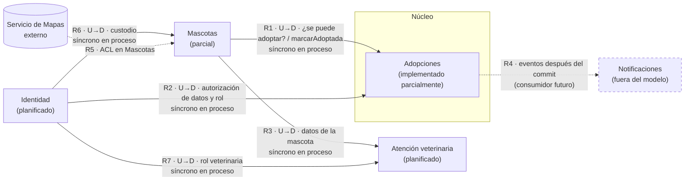

# Responsabilidades de los bounded contexts
## Módulo 5 · Entregable 1 — Context Map justificado

Cada contexto declara **qué posee** (conceptos y datos de los que es el
único dueño) y **qué no posee**. La prueba aplicada a cada frontera es:
*"¿qué responsabilidad protege esta frontera y por qué no pertenece al
contexto vecino?"*

Las referencias RO1–RO6 (responsabilidades observables en el código),
D1–D5 (decisiones del equipo) y P1–P5 (preguntas abiertas) están en
[`modelo-dominio.md`](./modelo-dominio.md).

---

## 1. Contextos

### Adopciones — núcleo · implementado parcialmente

| | |
|---|---|
| **Responsabilidad** | Gestionar la solicitud de adopción de una mascota concreta, desde que se recibe hasta que se aprueba, rechaza o cancela. |
| **Posee** | `SolicitudAdopcion` y su estado (resultado global, D1); `EtapaAdopcion` como historial del proceso (D1); el compromiso de adopción (D5); la regla TRX-02; tablas `solicitud_adopcion` y `etapa_adopcion`. |
| **No posee** | El estado y el ciclo de vida de la mascota (D3); la autorización de tratamiento de datos (D5); los datos personales del adoptante; el historial clínico. |
| **Por qué esta frontera** | La solicitud avanza por etapas sin que la mascota cambie (D1), y TRX-02 exige que solicitud y etapa se escriban en una sola transacción (QA-02, verificado por `AdopcionControllerRollbackIntegrationTest`). Mientras ambas vivan en el mismo contexto, la atomicidad no necesita coordinación entre contextos. |
| **Evidencia** | HECHO para solicitud, estado, etapa y TRX-02 (RO1–RO3). DECISIÓN para el historial de etapas, la referencia a la mascota y el compromiso (D1, D2, D5). |
| **Código** | `api/adopciones/` (`AdopcionController`, `AdopcionService`, repositorios, `model/`) |

### Mascotas — soporte · parcial

| | |
|---|---|
| **Responsabilidad** | Gestionar el ciclo de vida de cada animal bajo custodia. |
| **Posee** | `Mascota` (planificada), su estado (En tratamiento, Extraviada, Cuarentena, Adoptada…, D3) y su custodio (D4). |
| **No posee** | Las solicitudes de adopción ni sus etapas; el historial clínico; los datos personales del custodio. |
| **Por qué no pertenece a Adopciones** | La mascota cambia de estado aunque no haya ninguna solicitud (D3) y puede no ser adoptada nunca. Si Adopciones fuera dueña de `Mascota`, cada cambio de cuidado o custodia obligaría a tocar el núcleo. |
| **Evidencia** | DECISIÓN (D3, D4). En el código solo hay un endpoint simulado (RO4). La ubicación queda pendiente de P3. |
| **Código** | `api/mascotas/MascotaController` (respuesta simulada). No existen `Mascota`, `MascotaService` ni `MascotaRepository`. |

### Atención veterinaria — soporte · planificado

| | |
|---|---|
| **Responsabilidad** | Registrar la información de salud de los animales. |
| **Posee** | Historial clínico, tratamiento, certificado de salud (D4). |
| **No posee** | La aprobación o el rechazo de solicitudes; el estado de la mascota (P4); los datos de la veterinaria como organización (son de Identidad). |
| **Por qué esta frontera** | La veterinaria certifica la salud pero no decide sobre la custodia ni la adopción (D4). La atención ocurre antes, durante y después de una adopción, y también para mascotas que nunca se adoptan. |
| **Evidencia** | DECISIÓN (D4); sin código (RO5). |
| **Código** | Paquete `veterinarias/` declarado en ADR-01/ADR-03, sin clases. |

### Identidad — genérico · planificado

| | |
|---|---|
| **Responsabilidad** | Identidad de las personas y organizaciones que usan la plataforma, su rol y la autorización de tratamiento de datos (QA-01, Ley 1581). |
| **Posee** | Participante (adoptante, custodio —fundación o refugio—, veterinaria), rol, autorización de tratamiento de datos (D5), permisos. |
| **No posee** | El compromiso de adopción (D5); solicitudes; mascotas; historial clínico. |
| **Por qué esta frontera** | Concentra los datos personales en un solo contexto: es el único lugar donde hay que aplicar la auditoría y el consentimiento de la Ley 1581. Los demás contextos solo guardan identificadores. La autorización de datos aplica a toda la plataforma; el compromiso de adopción, solo a una solicitud (D5). |
| **Evidencia** | HECHO como driver (QA-01, RO6); DECISIÓN (D4, D5). |
| **Código** | No existe. |

---

## 2. Relaciones del Context Map

Cada relación indica quién depende de quién (**upstream** = proveedor,
**downstream** = consumidor), qué información fluye y cómo. La decisión
síncrona/asíncrona de cada una se justifica en
[`sincrono-vs-asincrono.md`](../integracion/sincrono-vs-asincrono.md).

| # | Relación | Patrón | Qué fluye y en qué dirección | Mecanismo | Estado |
|---|---|---|---|---|---|
| R1 | Mascotas → Adopciones | Cliente/Proveedor (Mascotas upstream) | Antes de crear la solicitud, Adopciones pregunta si la mascota puede adoptarse (D2, P1) y quién es su custodio (D4). Al aprobar la adopción, Adopciones pide a Mascotas `marcarAdoptada(mascotaId)`; Mascotas cambia su propio estado (P5). Mascotas nunca lee solicitudes. | Síncrono en proceso: servicio público `MascotaService` (ADR-02, ADR-03 Decisión 3) | Planificada: hoy Adopciones no recibe `mascotaId` |
| R2 | Identidad → Adopciones | Cliente/Proveedor (Identidad upstream) | Adopciones pregunta si el adoptante tiene autorización de datos vigente (QA-01, D5) y si quien aprueba tiene rol de custodio (D4). Solo guarda identificadores. | Síncrono en proceso | Planificada |
| R3 | Mascotas → Atención veterinaria | Cliente/Proveedor (Mascotas upstream) | Atención veterinaria consulta la identidad y el estado de la mascota atendida. Si puede o no cambiar ese estado está abierto (P4). | Síncrono en proceso | Planificada |
| R4 | Adopciones → Notificaciones | Publicador/Suscriptor (Adopciones upstream) | Adopciones publica hechos como `SolicitudAdopcionAvanzoDeEtapa`; un futuro consumidor decide a quién avisar. **Notificaciones está fuera del modelo** (`modelo-dominio.md` §6): la relación se conserva solo como diseño del evento. | Asíncrono: evento después del commit ([`eventos-candidatos.md`](../integracion/eventos-candidatos.md)) | Aplazada (ADR-03, Alternativa B) |
| R5 | Servicio de Mapas → Mascotas | Capa anticorrupción (ACL) en Mascotas | Mascotas traduce coordenadas y distancias del proveedor externo a su propio modelo. Depende de P3. | Llamada HTTP externa detrás de un adaptador | Planificada; hoy simulada |
| R6 | Identidad → Mascotas | Cliente/Proveedor (Identidad upstream) | Mascotas registra el custodio de cada animal como identificador de un participante con rol de custodio (D4). | Síncrono en proceso | Planificada |
| R7 | Identidad → Atención veterinaria | Cliente/Proveedor (Identidad upstream) | Atención veterinaria verifica que quien registra el historial clínico es un participante con rol de veterinaria (D4). | Síncrono en proceso | Planificada |

**Reglas que hacen cumplir estas relaciones** (ADR-02): ningún contexto
importa repositorios ni modelos de otro; solo servicios públicos o DTOs de
`shared/`. Verificado para Adopciones y Mascotas en el spike (Y2 = 0).

Ninguna de estas relaciones existe hoy en el código.

---

## 3. Diagrama

Fuente PlantUML: [`context-map.puml`](./context-map.puml)
([PNG](./context-map.png)). Versión Mermaid equivalente (se ve directamente
en GitHub):

Flecha continua = relación síncrona; discontinua = asíncrona, externa o
fuera del modelo. La flecha va del proveedor (upstream) al consumidor
(downstream).

---

## 4. Prueba del Context Map aplicada

| Frontera | ¿Qué protege? | ¿Por qué no pertenece al vecino? |
|---|---|---|
| Adopciones / Mascotas | La atomicidad de TRX-02 y el proceso de la solicitud | La mascota cambia de estado sin solicitudes (D3); la solicitud avanza por etapas sin que la mascota cambie (D1) |
| Adopciones / Identidad | Los datos personales y la autorización de datos (Ley 1581) | La autorización aplica a toda la plataforma; el compromiso de adopción, solo a una solicitud (D5). Adopciones solo necesita saber si el participante está habilitado |
| Mascotas / Atención veterinaria | El ciclo de vida y la custodia de la mascota | La veterinaria certifica la salud pero no decide sobre custodia ni adopción (D4) |
| Mascotas / Identidad | Los datos personales del custodio | Mascotas solo necesita saber quién es el custodio, no sus datos personales |
| Mascotas / Servicio de Mapas | El modelo propio de ubicación | El proveedor externo puede cambiar sin afectar al dominio |
| Adopciones / Notificaciones | La operación de adopción frente a fallos del proveedor externo | Avisar no es una regla de negocio: la solicitud es válida aunque el aviso falle |

---

*Autores: Kevin Steven Torres Caro · Charry Ríos Daniel Estiven*
*Semana 10 · Módulo 5 · Arquitectura de Software*
