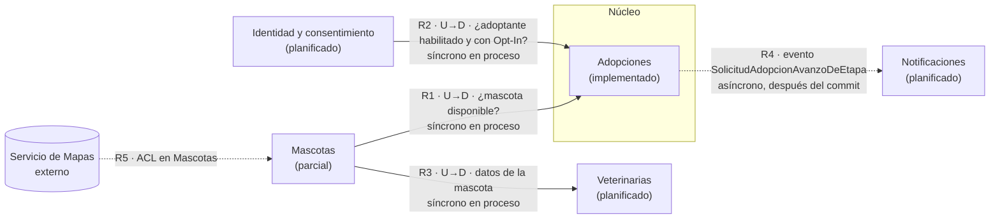

# Responsabilidades de los bounded contexts
## Módulo 5 · Entregable 1 — Context Map justificado

Cada contexto declara **qué posee** (conceptos y datos de los que es el
único dueño) y **qué no posee**. La prueba aplicada a cada frontera es:
*"¿qué responsabilidad protege esta frontera y por qué no pertenece al
contexto vecino?"*

---

## 1. Contextos

### Adopciones — núcleo · implementado

| | |
|---|---|
| **Responsabilidad** | Gestionar el ciclo de vida de una solicitud de adopción: crearla con su etapa inicial y registrar el avance por etapas. |
| **Posee** | `SolicitudAdopcion` (estado, fecha), `EtapaAdopcion` (nombre de etapa, fecha), tablas `solicitud_adopcion` y `etapas_adopcion`, la regla TRX-02. |
| **No posee** | Los datos de la mascota (raza, ubicación, salud), la identidad del adoptante ni su consentimiento, el envío de mensajes. |
| **Por qué esta frontera** | TRX-02 exige que solicitud y etapa se escriban en una sola transacción (QA-02, verificado por `AdopcionControllerRollbackIntegrationTest`). Mientras ambas vivan en el mismo contexto, la atomicidad no necesita coordinación entre contextos. |
| **Código** | `api/adopciones/` (`AdopcionController`, `AdopcionService`, repositorios, `model/`) |

### Mascotas — soporte · parcial

| | |
|---|---|
| **Responsabilidad** | Registrar las mascotas, su ubicación y si están disponibles para adopción; responder búsquedas por cercanía. |
| **Posee** | `Mascota` (planificada), su ubicación y su estado de disponibilidad. |
| **No posee** | Las solicitudes de adopción ni sus etapas; las citas veterinarias; la identidad de quien busca. |
| **Por qué no pertenece a Adopciones** | Una mascota existe antes de que nadie la solicite y puede no ser adoptada nunca; su búsqueda geoespacial (QA-03: paginación y clustering) tiene necesidades distintas a la transacción de adopción. Si Adopciones fuera dueña de `Mascota`, cualquier cambio en la búsqueda obligaría a tocar el núcleo. |
| **Código** | `api/mascotas/MascotaController` (respuesta simulada). No existen `Mascota`, `MascotaService` ni `MascotaRepository`. |

### Veterinarias — soporte · planificado

| | |
|---|---|
| **Responsabilidad** | Servicios y citas veterinarias asociadas a mascotas. |
| **Posee** | Veterinaria, servicio, cita (planificados). |
| **No posee** | El estado de adopción; los datos maestros de la mascota (los consulta a Mascotas). |
| **Por qué esta frontera** | La atención veterinaria ocurre antes, durante y después de una adopción y para mascotas que nunca se adoptan; mezclarla con Adopciones acoplaría dos ciclos de vida independientes. |
| **Código** | Paquete declarado en ADR-01, sin clases. |

### Identidad y consentimiento — genérico · planificado

| | |
|---|---|
| **Responsabilidad** | Usuarios (adoptantes), entidades (fundaciones, refugios, veterinarias), autenticación y Opt-In de la Ley 1581 (QA-01). |
| **Posee** | Usuario, entidad, consentimiento (Opt-In inmutable), permisos. |
| **No posee** | Solicitudes de adopción, mascotas, citas. |
| **Por qué esta frontera** | Concentra los datos personales en un solo contexto: es el único lugar donde hay que aplicar la auditoría y el consentimiento de la Ley 1581. Los demás contextos solo guardan un identificador del usuario. |
| **Código** | No existe. |

### Notificaciones — genérico · planificado

| | |
|---|---|
| **Responsabilidad** | Enviar mensajes a usuarios y fundaciones cuando ocurre algo relevante (por ejemplo, cambio de etapa de una solicitud). |
| **Posee** | Plantillas, envíos y su resultado (enviado / fallido / reintento). |
| **No posee** | La decisión de negocio que provoca el aviso: solo reacciona a hechos que otros contextos publican. |
| **Por qué esta frontera** | Habla con un proveedor externo (condición del mini-comité de Semana 8: cifrado en tránsito y autenticación). Aislarlo evita que un fallo del proveedor afecte a TRX-02. |
| **Código** | No existe. |

---

## 2. Relaciones del Context Map

Cada relación indica quién depende de quién (**upstream** = proveedor,
**downstream** = consumidor), qué información fluye y cómo.

| # | Relación | Patrón | Qué fluye y en qué dirección | Mecanismo | Estado |
|---|---|---|---|---|---|
| R1 | Mascotas → Adopciones | Cliente/Proveedor (Mascotas upstream) | Adopciones pregunta a Mascotas si una mascota existe y está disponible antes de crear una solicitud. Mascotas nunca lee solicitudes. | Síncrono en proceso: servicio público `MascotaService` (ADR-02, ADR-03 Decisión 3) | Planificada: hoy Adopciones no recibe `mascotaId` |
| R2 | Identidad → Adopciones | Cliente/Proveedor (Identidad upstream) | Adopciones pregunta si el adoptante está autenticado y tiene Opt-In vigente. Solo guarda su identificador. | Síncrono en proceso | Planificada |
| R3 | Mascotas → Veterinarias | Cliente/Proveedor (Mascotas upstream) | Veterinarias consulta datos básicos de la mascota atendida. | Síncrono en proceso | Planificada |
| R4 | Adopciones → Notificaciones | Publicador/Suscriptor (Adopciones upstream) | Adopciones publica "la solicitud cambió de etapa"; Notificaciones decide a quién avisar. Adopciones no espera respuesta. | Asíncrono: evento publicado después del commit (`docs/integracion/eventos-candidatos.md`) | Planificada (Alternativa B de ADR-03, aplazada) |
| R5 | Servicio de Mapas → Mascotas | Capa anticorrupción (ACL) en Mascotas | Mascotas traduce coordenadas y distancias del proveedor externo a su propio modelo. | Llamada HTTP externa detrás de un adaptador | Planificada; hoy simulada |

**Reglas que hacen cumplir estas relaciones** (ADR-02): ningún contexto
importa repositorios ni modelos de otro; solo servicios públicos o DTOs de
`shared/`. Verificado para Adopciones y Mascotas en el spike (Y2 = 0).

---

## 3. Diagrama

Fuente PlantUML: [`context-map.puml`](./context-map.puml). Versión
Mermaid equivalente (se ve directamente en GitHub):

Flecha continua = relación síncrona; discontinua = asíncrona o externa.
La flecha va del proveedor (upstream) al consumidor (downstream).

---

## 4. Prueba del Context Map aplicada

| Frontera | ¿Qué protege? | ¿Por qué no pertenece al vecino? |
|---|---|---|
| Adopciones / Mascotas | La atomicidad de TRX-02 y el ciclo de vida de la solicitud | La mascota existe sin solicitud; la búsqueda geoespacial evoluciona sin tocar el núcleo |
| Adopciones / Identidad | Los datos personales y el consentimiento (Ley 1581) | Adopciones solo necesita saber si el usuario está habilitado, no sus datos personales |
| Adopciones / Notificaciones | La operación de adopción frente a fallos del proveedor externo | Avisar no forma parte de la regla de negocio: la solicitud es válida aunque el aviso falle |
| Mascotas / Veterinarias | Los datos maestros de la mascota | La atención veterinaria tiene su propio ciclo (citas, servicios) |
| Mascotas / Servicio de Mapas | El modelo propio de ubicación | El proveedor externo puede cambiar sin afectar al dominio |

---

*Autores: Kevin Steven Torres Caro · Charry Ríos Daniel Estiven*
*Semana 10 · Módulo 5 · Arquitectura de Software*
