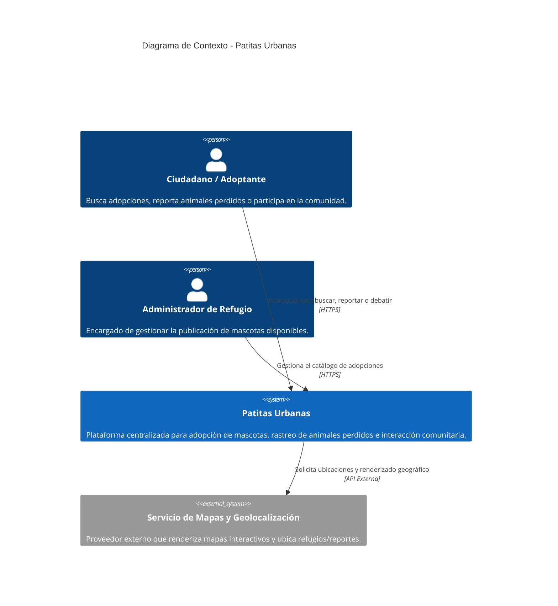

# C4 Nivel 1: Diagrama de Contexto

**Audiencia:** Patrocinadores, stakeholders de negocio y equipo de desarrollo.
**Propósito:** Visualizar el alcance del sistema Patitas Urbanas, identificando a los usuarios principales y las dependencias con plataformas externas.

