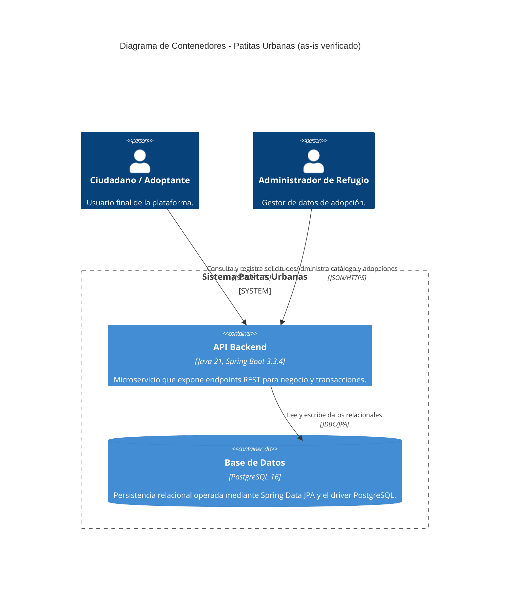
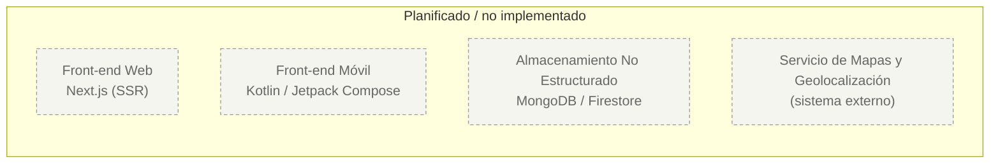

# C4 Nivel 2: Diagrama de Contenedores

**Audiencia:** Arquitectos de software y desarrolladores.
**Propósito:** Desglosar el sistema en sus unidades de despliegue físico, evidenciando las decisiones tecnológicas reales y los flujos de comunicación internos.

## Diagrama de contenedores (as-is verificado)

## Elementos planificados (fuera del as-is)

Los siguientes elementos no tienen evidencia real de implementación en el repositorio y se mantienen solo como contexto de negocio, con estilo punteado para distinguirlos del estado actual.

## Trazabilidad de contenedores

| Contenedor del C4 | Evidencia real (archivo/ruta) | Estado |
|---|---|---|
| API Backend | `docker-compose.yml`, `app/pom.xml`, `app/src/main/java/com/patitasurbanas/` | Verificado |
| Base de Datos | `docker-compose.yml`, `app/src/main/resources/application.properties`, `app/src/test/resources/application-test.properties` | Verificado |

## Registro de correcciones

Antes el diagrama mostraba un contenedor web, móvil, caché NoSQL y un servicio de mapas como parte del sistema actual. Se corrigió a la realidad del repositorio: el backend es Spring Boot y la base de datos es PostgreSQL 16 sin PostGIS, evidenciado por `docker-compose.yml` y los artefactos de la app. Los elementos no implementados se mantienen como futuros con estilo punteado, sin mezclarlos con el as-is. Esta corrección evita presentar requisitos planeados como si ya estuvieran desplegados.

**Evidencia utilizada:** `docker-compose.yml`, `app/pom.xml`, `app/src/main/resources/application.properties`.
