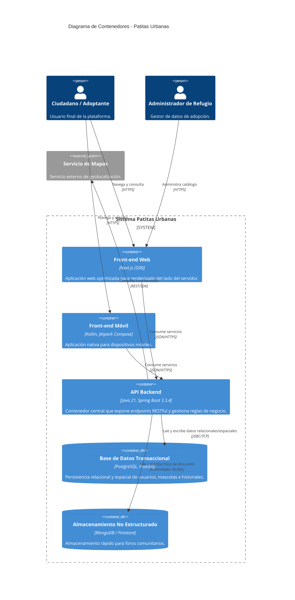

# C4 Nivel 2: Diagrama de Contenedores

**Audiencia:** Arquitectos de software y desarrolladores.
**Propósito:** Desglosar el sistema en sus unidades de despliegue físico, evidenciando las decisiones tecnológicas reales y los flujos de comunicación internos.

