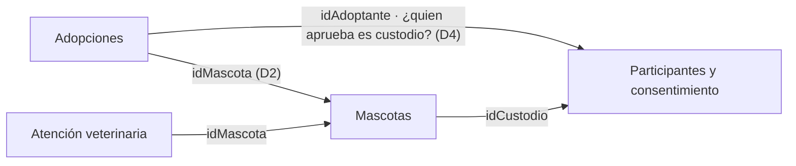

# 18 — Entregable 1: Modelo del dominio
## Patitas Urbanas

---

## 1. Propósito y método

Construir el modelo del dominio de Patitas Urbanas a partir de
**evidencia del sistema real**, no del diseño modular to-be. El
documento `15-diseno-modular-s7.md` ya propone módulos; usarlos como
punto de partida solo confirmaría una decisión tomada antes. Por eso
el orden es:

1. Inventario de responsabilidades observables en el repositorio (§2).
2. Términos ambiguos e inconsistencias encontradas (§3, §4).
3. Decisiones de negocio tomadas por el equipo para resolver lo que el
   repositorio no demuestra (§5).
4. Modelo resultante, donde cada concepto se apoya en evidencia o en
   una decisión explícita (§6).

Cada afirmación se marca como:

- **HECHO:** demostrado por código, prueba o documento del repositorio.
- **INFERENCIA:** se deduce de los hechos, pero no está demostrado.
- **DECISIÓN DEL EQUIPO:** regla de negocio definida por el equipo en
  §5; no está todavía en el código.
- **FALTANTE:** ni el repositorio ni el equipo lo han definido.

Alcance: rama `main` en el commit `a16aa9b`.

---

## 2. Inventario de responsabilidades observables

### R1. Registrar una solicitud de adopción

- **HECHO:** `AdopcionService.crearSolicitudConEtapaInicial` crea y
  persiste una `SolicitudAdopcion` con `estado` y `fechaCreacion`
  ([AdopcionService.java](https://github.com/Charry21/PatitasUrbanas/blob/main/app/src/main/java/com/patitasurbanas/api/adopciones/AdopcionService.java#L27-L44),
  [SolicitudAdopcion.java](https://github.com/Charry21/PatitasUrbanas/blob/main/app/src/main/java/com/patitasurbanas/api/adopciones/model/SolicitudAdopcion.java)).
  Si no se envía estado, el código usa `PENDIENTE`.
- **FALTANTE en el código:** la solicitud no referencia ni al adoptante
  ni a la mascota.

### R2. Registrar la etapa de una solicitud

- **HECHO:** `EtapaAdopcion` tiene `nombreEtapa`, `fechaCambio` y una
  relación `ManyToOne` obligatoria con la solicitud (FK
  `solicitud_adopcion_id`, tabla `etapa_adopcion`)
  ([EtapaAdopcion.java](https://github.com/Charry21/PatitasUrbanas/blob/main/app/src/main/java/com/patitasurbanas/api/adopciones/model/EtapaAdopcion.java#L15-L32)).
  Hoy solo se crea la etapa inicial (`SOLICITUD_RECIBIDA` por defecto);
  no hay operación para registrar etapas siguientes.

### R3. Mantener la consistencia entre solicitud y etapa

- **HECHO:** la creación de solicitud y etapa ocurre en un único
  `@Transactional`, y
  [AdopcionControllerRollbackIntegrationTest](https://github.com/Charry21/PatitasUrbanas/blob/main/app/src/test/java/com/patitasurbanas/api/controller/AdopcionControllerRollbackIntegrationTest.java#L32-L33)
  verifica que un fallo revierte ambas. Responde al driver QA-02
  ([02-stakeholders-drivers.md](https://github.com/Charry21/PatitasUrbanas/blob/main/dossier/02-stakeholders-drivers.md)).
- **INFERENCIA:** hoy la operación trata solicitud y etapa como una
  unidad. Esto por sí solo no prueba que pertenezcan a la misma frontera
  conceptual; §5 lo resuelve con la decisión D1.

### R4. Consultar mascotas

- **HECHO:** existe `MascotaController` (`GET /api/mascotas/buscar`),
  pero devuelve una respuesta fija; el C4 lo documenta como simulación
  ([MascotaController.java](https://github.com/Charry21/PatitasUrbanas/blob/main/app/src/main/java/com/patitasurbanas/api/mascotas/MascotaController.java),
  [07-c4-componentes.md](https://github.com/Charry21/PatitasUrbanas/blob/main/dossier/07-c4-componentes.md)).
- **FALTANTE en el código:** entidad `Mascota`, su estado, su
  disponibilidad y su relación con una solicitud.

### R5. Servicios veterinarios

- **HECHO:** solo como intención. El propósito del sistema menciona
  integrar servicios veterinarios
  ([01-contexto-sistema.md](https://github.com/Charry21/PatitasUrbanas/blob/main/dossier/01-contexto-sistema.md))
  y `15-diseno-modular-s7.md` declara `veterinarias/` sin código.
- **FALTANTE en el código:** cualquier operación veterinaria.

### R6. Consentimiento y control de acceso

- **HECHO:** solo como driver y restricción. QA-01 exige un Opt-In
  explícito al registrarse y negar escrituras sin permisos; el contexto
  impone la Ley 1581 de 2012.
- **FALTANTE en el código:** usuarios, roles, consentimientos y
  autorización.

### Dependencias demostradas

La única relación respaldada a la vez por modelo, servicio, persistencia
y prueba es **Solicitud → Etapa**. Cualquier relación con mascotas,
veterinarias o usuarios es hoy conceptual.

---

## 3. Términos que necesitaban definición

| Término | Lo que muestra el repositorio | Definición adoptada (ver §5) |
|---|---|---|
| Estado de la solicitud | Campo `String`; valor por defecto `PENDIENTE` | Resultado global de la solicitud (D1) |
| Etapa | `nombreEtapa` + `fechaCambio`; valor por defecto `SOLICITUD_RECIBIDA` | Paso del proceso; el conjunto de etapas es el historial (D1) |
| Mascota | Solo endpoint simulado | Animal con ciclo de vida propio, independiente de las solicitudes (D3) |
| Fundación / refugio | Se usan en distintos documentos | Mismo rol: custodio del animal (D4) |
| Veterinaria | Actor y módulo futuro | Rol de soporte médico, sin autoridad sobre la adopción (D4) |
| Consentimiento | Opt-In en QA-01 | Dos conceptos distintos: autorización de datos y compromiso de adopción (D5) |
| Disponible | Aparece en QA-03 ("mascotas disponibles") | **FALTANTE** (P1) |
| Adoptante / ciudadano / usuario final | Usados como sinónimos | **FALTANTE**; se trata como el mismo actor hasta que se decida lo contrario |

---

## 4. Inconsistencias encontradas

| # | Inconsistencia | Evidencia | Tratamiento |
|---|---|---|---|
| C1 | El C4 de contenedores llama "Microservicio" al backend; el diseño modular dice que es un monolito | [06-c4-contenedores.md](https://github.com/Charry21/PatitasUrbanas/blob/main/dossier/06-c4-contenedores.md) vs. `15-diseno-modular-s7.md` §2 (P-04) | Se usa "monolito"; corregir el C4 en un PR aparte |
| C2 | La documentación dice `etapas_adopcion`; el código usa `etapa_adopcion` | `@Table(name = "etapa_adopcion")` vs. QA-02 y otros documentos | Se usa el nombre del código |
| C3 | El propósito promete integración veterinaria; no hay código | `01-contexto-sistema.md` §1 vs. `15-diseno-modular-s7.md` §9 | Veterinaria entra al modelo como decisión, no como hecho |
| C4 | QA-03 describe catálogo y clustering geográfico; el endpoint es simulado | `02-stakeholders-drivers.md` QA-03 vs. `MascotaController` | La geolocalización queda fuera del modelo (P3) |
| C5 | Los estados definidos por el equipo no incluyen `PENDIENTE`, que es el valor por defecto en el código | D1 vs. `AdopcionService` | **Por resolver** (P2) |

---

## 5. Decisiones de negocio del equipo

Estas reglas no salen del repositorio; las define el equipo para cerrar
lo que el código no demuestra.

**D1 — Estado y etapa son conceptos distintos.**
El *estado* es el resultado global de la solicitud (Activa, Aprobada,
Rechazada, Cancelada). La *etapa* es el paso del proceso en que está
(Revisión de formulario, Entrevista, Visita domiciliaria). Las etapas
forman el historial cronológico de la solicitud.
*Consecuencia:* la etapa es parte de la solicitud, no una preocupación
separada. Esto justifica que solicitud y etapa compartan frontera (R3).
*Brecha con el código:* `EtapaAdopcion` no registra quién hizo el
cambio, y no existe operación para añadir etapas después de la inicial.

**D2 — Toda solicitud es por una mascota concreta.**
No existe un proceso de pre-aprobación de adoptantes independiente, así
que una solicitud no puede existir sin el identificador de una mascota.
*Brecha con el código:* `SolicitudAdopcion` no tiene esa referencia.

**D3 — La mascota tiene su propio ciclo de vida.**
Su estado (En tratamiento, Extraviada, Cuarentena, Fallecida, etc.)
cambia aunque no exista ninguna solicitud.
*Consecuencia:* Mascota y Solicitud cambian por razones distintas; es
la principal evidencia para separarlas.

**D4 — Solo el custodio aprueba o rechaza.**
Fundación y refugio cumplen el mismo rol: custodio legal del animal,
con autoridad para aprobar o rechazar solicitudes. La veterinaria
registra el historial clínico, programa tratamientos y certifica el
estado de salud, pero no decide sobre la adopción.

**D5 — Hay dos consentimientos distintos.**
1. *Autorización de tratamiento de datos* (Ley 1581 de 2012): se otorga
   al registrarse y aplica a toda la plataforma.
2. *Compromiso de adopción*: se acepta al final de la solicitud,
   asume las responsabilidades de bienestar animal (referencia: Ley 1774
   de 2016) y es obligatorio para ejecutar la etapa final.
*Consecuencia:* el primero pertenece a la identidad del participante; el
segundo, al proceso de adopción.

---

## 6. Modelo del dominio

A partir de la evidencia (§2) y las decisiones (§5) emergen **cuatro**
responsabilidades. Cada una protege conceptos propios y declara
explícitamente lo que *no* le pertenece.

### Adopciones

Gestiona la solicitud de adopción de una mascota concreta, desde que se
recibe hasta que se aprueba, rechaza o cancela.

- **Posee:** *Solicitud de adopción, estado de la solicitud, etapa
  (historial), compromiso de adopción.*
- **No posee:** el estado de salud ni el ciclo de vida de la mascota,
  la autorización de tratamiento de datos, la identidad del adoptante.
- **Evidencia:** HECHO para solicitud, estado y etapa (R1–R3);
  DECISIÓN para el historial y el compromiso (D1, D5).

### Mascotas

Gestiona el ciclo de vida de cada animal bajo custodia.

- **Posee:** *Mascota, estado de la mascota, custodio.*
- **No posee:** solicitudes de adopción ni sus etapas, historial
  clínico.
- **Evidencia:** DECISIÓN (D3, D4); en el código solo hay un endpoint
  simulado (R4).

### Atención veterinaria

Registra la información de salud de los animales.

- **Posee:** *Historial clínico, tratamiento, certificado de salud.*
- **No posee:** la aprobación o el rechazo de solicitudes, el estado de
  la solicitud.
- **Evidencia:** DECISIÓN (D4); sin código (R5).

### Participantes y consentimiento

Identidad de las personas y organizaciones, su rol y la autorización
de tratamiento de datos.

- **Posee:** *Participante (adoptante, custodio, veterinaria), rol,
  autorización de tratamiento de datos.*
- **No posee:** el compromiso de adopción, el estado de las mascotas.
- **Evidencia:** HECHO como driver (QA-01, R6); DECISIÓN (D4, D5).

### Resumen

| Responsabilidad | Posee | No posee | Respaldo |
|---|---|---|---|
| Adopciones | Solicitud, estado, etapa, compromiso de adopción | Ciclo de vida de la mascota, autorización de datos | Código + D1, D2, D5 |
| Mascotas | Mascota, estado de la mascota, custodio | Solicitudes y etapas, historial clínico | D3, D4 |
| Atención veterinaria | Historial clínico, tratamiento, certificado de salud | Aprobación de solicitudes | D4 |
| Participantes y consentimiento | Participante, rol, autorización de datos | Compromiso de adopción, estado de mascotas | QA-01 + D4, D5 |

### Por qué estas fronteras

Cada frontera separa reglas que cambian por motivos distintos:

- **Adopciones / Mascotas:** una mascota cambia de estado sin
  solicitudes (D3) y una solicitud avanza por etapas sin que la mascota
  cambie (D1).
- **Mascotas / Atención veterinaria:** la veterinaria certifica salud
  pero no decide sobre la custodia ni la adopción (D4).
- **Adopciones / Participantes:** la autorización de datos aplica a toda
  la plataforma; el compromiso de adopción solo a una solicitud (D5).

### Relaciones que el modelo exige

Ninguna de estas relaciones existe hoy en el código.

---

## 7. Fuera del modelo actual

- **Notificaciones, donaciones y chat:** aparecen en el dossier como
  ideas futuras, pero no hay código ni decisión de negocio que defina
  sus reglas.
- **Geolocalización:** está en QA-03, pero el endpoint es simulado (C4).

---

## 8. Preguntas abiertas

| # | Pregunta | Por qué importa |
|---|---|---|
| P1 | ¿Qué estados de la mascota permiten crear una solicitud? ¿Qué significa "disponible"? | Define la regla que conecta Adopciones con Mascotas |
| P2 | ¿`PENDIENTE` equivale a "Activa" o es otro estado? | Resuelve C5 entre las decisiones y el código |
| P3 | ¿La geolocalización cambia alguna regla de negocio o solo sirve para buscar? | Define si es parte de Mascotas o una capacidad transversal |
| P4 | ¿Una veterinaria puede cambiar el estado de la mascota (por ejemplo, a "En tratamiento") o solo lo informa? | Define la relación entre Atención veterinaria y Mascotas |
| P5 | Cuando se aprueba una adopción, ¿qué le pasa al estado de la mascota y quién lo cambia? | Es la primera interacción real entre módulos y el insumo para decidir integración síncrona o asíncrona |

---

*Autores: Kevin Steven Torres Caro · Charry Ríos Daniel Estiven*
*Arquitectura de Software*
